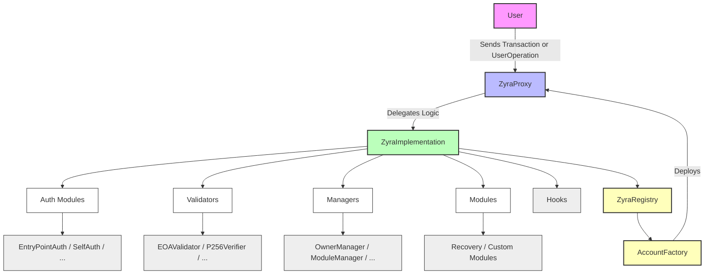

# Zyra AA Wallet

<div align="center">


**A next-generation Account Abstraction (AA) wallet system built with Foundry**

[Features](#-features) • [Architecture](#-architecture) • [Quick Start](#-quick-start) • [Documentation](#-documentation) • [Contributing](#-contributing)

</div>

---

## 🚀 Overview

Zyra AA Wallet is a comprehensive Account Abstraction solution that brings the future of Web3 wallets to the present. Built on the EIP-4337 standard, Zyra provides a modular, upgradeable, and gas-efficient smart contract system that enables advanced wallet features like session keys, social recovery, and programmable transaction logic.

### Key Highlights

- **🔐 EIP-4337 Compliant**: Full Account Abstraction support with ERC-4337 standard
- **🧩 Modular Architecture**: Pluggable modules, validators, and hooks for extensibility
- **⚡ Gas Optimized**: ERC-1167 minimal proxy pattern for efficient deployments
- **🔄 Upgradeable**: Diamond storage pattern for safe contract upgrades
- **🔑 Session Management**: Temporary authorization keys for enhanced UX
- **🛡️ Recovery Systems**: Social and cloud-based recovery mechanisms
- **🌐 Multi-chain Ready**: Deployable across Ethereum, Avalanche, and other EVM chains

## 🏗️ Architecture

### System Flow



### Project Structure

```
Zyra-AA-Wallet/
├── 📁 smart-contracts/          # Core smart contract system
│   ├── 📁 src/
│   │   ├── 📁 auth/            # Authentication & authorization modules
│   │   ├── 📁 crypto/          # Cryptographic utilities (P256, etc.)
│   │   ├── 📁 handlers/        # Transaction & operation handlers
│   │   ├── 📁 helpers/         # Utility functions & helpers
│   │   ├── 📁 interfaces/      # Contract interfaces & ABIs
│   │   ├── 📁 libraries/       # Shared libraries & utilities
│   │   ├── 📁 managers/        # System management contracts
│   │   ├── 📁 modules/         # Pluggable feature modules
│   │   ├── 📁 validators/      # Signature & logic validators
│   │   ├── ZyraImplementation.sol  # Main wallet implementation
│   │   ├── ZyraProxy.sol       # Proxy contract for upgrades
│   │   └── ZyraRegistry.sol    # Registry for wallet management
│   ├── 📁 test/                # Comprehensive test suite
│   ├── 📁 script/              # Deployment & management scripts
│   ├── foundry.toml            # Foundry configuration
│   └── env.example             # Environment variables template
├── 📁 backend/                 # Backend services (coming soon)
├── 📁 frontend/                # Frontend application (coming soon)
└── README.md                   # This file
```

## 🛠️ Quick Start

### Prerequisites

- [Foundry](https://getfoundry.sh/) (latest version)
- [Node.js](https://nodejs.org/) 16+ (for auxiliary tooling)
- [Git](https://git-scm.com/) (for version control)

### Installation

1. **Clone the repository**

   ```bash
   git clone https://github.com/your-username/Zyra-AA-Wallet.git
   cd Zyra-AA-Wallet
   ```

2. **Navigate to smart contracts**

   ```bash
   cd smart-contracts
   ```

3. **Install dependencies**

   ```bash
   forge install
   ```

4. **Set up environment**

   ```bash
   cp env.example .env
   # Edit .env with your configuration
   ```

5. **Build the project**
   ```bash
   forge build
   ```

### Testing

```bash
# Run all tests
forge test

# Run specific test file
forge test --match-contract ZyraImplementation

# Run with gas reporting
forge test --gas-report

# Run with verbose output
forge test -vvv
```

### Deployment

```bash
# Deploy to Sepolia testnet
forge script script/DeploySepolia.s.sol \
  --rpc-url $SEPOLIA_RPC_URL \
  --private-key $PRIVATE_KEY \
  --broadcast \
  --verify

# Deploy to Avalanche Fuji testnet
forge script script/DeployFuji.s.sol \
  --rpc-url $AVALANCHE_FUJI_RPC_URL \
  --private-key $PRIVATE_KEY \
  --broadcast \
  --verify

# Deploy to Mumbai testnet
forge script script/DeployMumbai.s.sol \
  --rpc-url $MUMBAI_RPC_URL \
  --private-key $PRIVATE_KEY \
  --broadcast \
  --verify
```

## 📋 Core Contracts

### ZyraImplementation

The main wallet implementation contract that handles:

- **Transaction Execution**: Processes user operations and transactions
- **EIP-4337 Validation**: Validates UserOperations according to ERC-4337 standard
- **ERC-1271 Support**: Validates signatures for smart contract interactions
- **Hook System**: Executes pre/post transaction hooks
- **Module Management**: Manages pluggable modules and their permissions

### ZyraProxy

Proxy contract implementing the upgradeable pattern:

- **Upgrade Safety**: Diamond storage pattern for safe upgrades
- **Gas Efficiency**: Minimal proxy overhead
- **Storage Isolation**: Clean separation of logic and storage

### AccountFactory

Factory contract for wallet creation:

- **ERC-1167 Proxies**: Deploys minimal proxies for gas efficiency
- **Batch Creation**: Supports creating multiple wallets in one transaction
- **Initialization**: Handles wallet setup and configuration

### ZyraRegistry

Registry contract for system management:

- **Wallet Tracking**: Maintains registry of all deployed wallets
- **Implementation Management**: Tracks current implementation versions
- **Account Factory**: Manages factory contract references

### EOAValidator

Standard ECDSA signature validator:

- **ECDSA Support**: Validates traditional EOA signatures
- **Multi-signature**: Supports multi-sig configurations
- **Gas Optimization**: Efficient signature verification

## 🔒 Security Features

### Access Control

- **Owner-based Permissions**: Granular access control system
- **Module Permissions**: Fine-grained module access management
- **Session Key Management**: Temporary authorization with expiration

### Recovery Mechanisms

- **Social Recovery**: Multi-party recovery with threshold signatures
- **Cloud Recovery**: Backup recovery through trusted cloud services
- **Time-locked Recovery**: Delayed recovery for enhanced security

### Upgrade Safety

- **Diamond Storage**: Safe storage layout for upgrades
- **Proxy Pattern**: Immutable proxy with upgradeable implementation
- **Timelock Contracts**: Delayed upgrades for community governance

## ⚡ Gas Optimization

### Deployment Efficiency

- **ERC-1167 Minimal Proxies**: ~45 bytes of deployment code
- **Factory Pattern**: Batch deployments for cost reduction
- **Storage Optimization**: Efficient storage layout and packing

### Runtime Optimization

- **Custom Errors**: Gas-efficient error handling
- **Batch Operations**: Multi-call transactions for efficiency
- **Optimized Loops**: Minimal gas consumption in iterations

## 🧪 Testing Strategy

### Test Coverage

- **Unit Tests**: Individual contract functionality
- **Integration Tests**: Cross-contract interactions
- **Gas Tests**: Performance and optimization validation
- **Security Tests**: Vulnerability and attack vector testing

### Test Categories

- **Authentication Tests**: Validator and auth module testing
- **Module Tests**: Pluggable module functionality
- **Recovery Tests**: Recovery mechanism validation
- **Upgrade Tests**: Proxy and upgrade functionality

## 📚 Documentation

### Smart Contracts

- [Contract Architecture](./smart-contracts/README.md)
- [API Reference](./docs/api.md) (coming soon)
- [Security Audit](./docs/security.md) (coming soon)

### Development

- [Development Guide](./docs/development.md) (coming soon)
- [Deployment Guide](./docs/deployment.md) (coming soon)
- [Testing Guide](./docs/testing.md) (coming soon)

## 🤝 Contributing

We welcome contributions from the community! Please see our [Contributing Guide](./CONTRIBUTING.md) for details.

### Development Setup

1. Fork the repository
2. Create a feature branch (`git checkout -b feature/amazing-feature`)
3. Commit your changes (`git commit -m 'Add amazing feature'`)
4. Push to the branch (`git push origin feature/amazing-feature`)
5. Open a Pull Request

### Code Standards

- Follow Solidity style guide
- Write comprehensive tests
- Update documentation
- Ensure gas optimization

## 📄 License

This project is licensed under the MIT License - see the [LICENSE](./LICENSE) file for details.

## 🆘 Support

### Getting Help

- 📖 [Documentation](./docs/)
- 🐛 [Issue Tracker](https://github.com/your-username/Zyra-AA-Wallet/issues)
- 💬 [Discussions](https://github.com/your-username/Zyra-AA-Wallet/discussions)
- 📧 [Email Support](mailto:support@zyra-wallet.com)

### Community

- 🐦 [Twitter](https://twitter.com/zyra_wallet)
- 💬 [Discord](https://discord.gg/zyra-wallet)
- 📺 [YouTube](https://youtube.com/@zyra-wallet)

---

<div align="center">

**Built with ❤️ by the Zyra Team**

[](https://github.com/your-username/Zyra-AA-Wallet/stargazers)
[](https://github.com/your-username/Zyra-AA-Wallet/network/members)
[](https://github.com/your-username/Zyra-AA-Wallet/issues)

</div>
